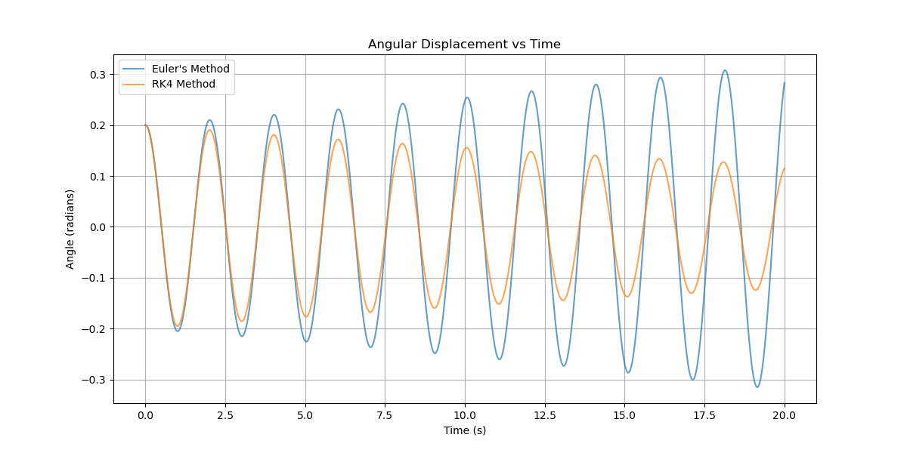
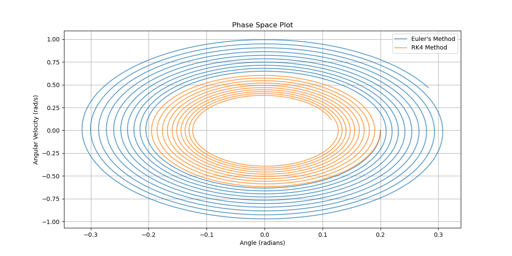
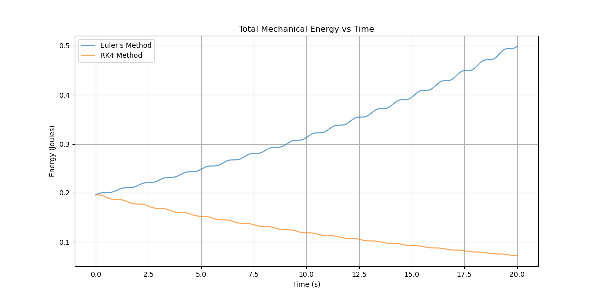
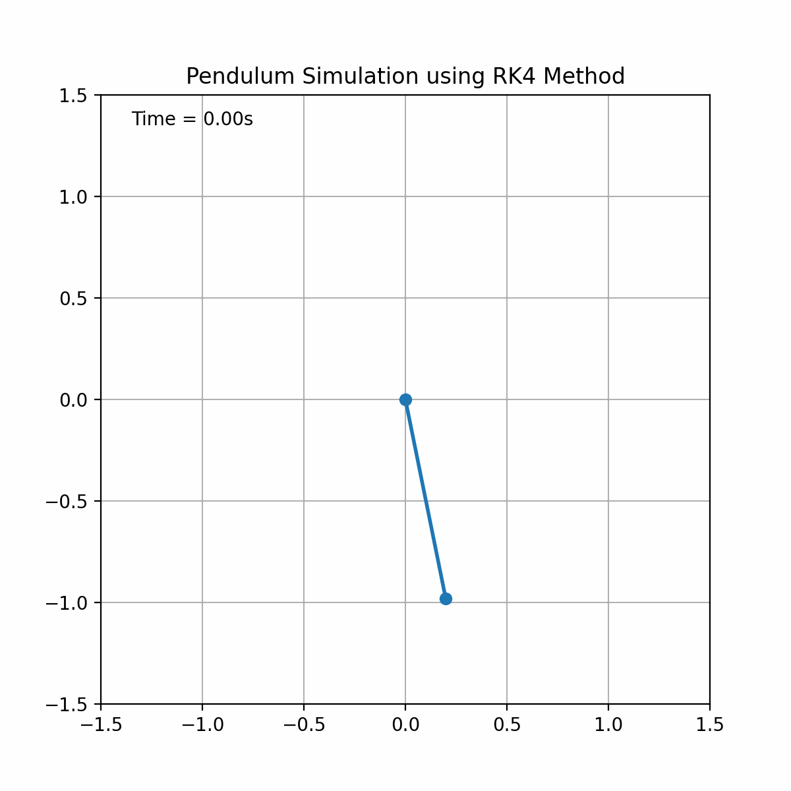

# Pendulum_simulation
# Pendulum Motion Simulation with Numerical Integration

## **Table of Contents**
- [Introduction](#introduction)
- [Motivation](#motivation)
- [Project Overview](#project-overview)
- [Mathematical Modeling](#mathematical-modeling)
- [Implementation](#implementation)
  - [Numerical Methods](#numerical-methods)
  - [Simulation Setup](#simulation-setup)
  - [Running Simulations](#running-simulations)
- [Results](#results)
  - [Angular Displacement vs Time](#angular-displacement-vs-time)
  - [Phase Space Plot](#phase-space-plot)
  - [Energy Conservation](#energy-conservation)
  - [Animation](#animation)
- [Analysis](#analysis)
- [Real Applications](#real-applications)
- [Skills Used](#skills-used)
- [Conclusion](#conclusion)
- [Future Work](#future-work)
- [References](#references)

## **Introduction**
The pendulum is a fundamental example of a dynamical system exhibiting periodic motion. This project simulates the motion of a damped simple pendulum using two numerical integration methods: Euler’s Method and the 4th-Order Runge-Kutta (RK4) Method. The simulation aims to compare the accuracy and stability of these methods in solving the pendulum's equations of motion.

## **Motivation**
Understanding the dynamics of pendulums provides insights into more complex oscillatory systems found in engineering and physics. Implementing numerical methods offers practical experience in computational problem-solving, essential for fields like Computational Science & Engineering (CSE).

## **Project Overview**
- **Objective:** Simulate the motion of a damped simple pendulum using Euler’s Method and the 4th-Order Runge-Kutta (RK4) Method to compare their accuracy and stability.
- **Tools:** Python, NumPy, Matplotlib
- **Duration:** 2-3 weeks
- **Key Components:** Mathematical modeling, numerical implementation, simulation, visualization, analysis.

## **Mathematical Modeling**
Derived the equations of motion for a damped simple pendulum:
\[
\frac{d^2\theta}{dt^2} + \frac{c}{mL} \frac{d\theta}{dt} + \frac{g}{L} \sin(\theta) = 0
\]
Converted to a system of first-order ODEs:
\[
\begin{cases}
\frac{d\theta_1}{dt} = \theta_2 \\
\frac{d\theta_2}{dt} = -\frac{g}{L} \sin(\theta_1) - \frac{c}{mL} \theta_2
\end{cases}
\]

## **Implementation**

### **Numerical Methods**
- **Euler’s Method:** A simple, first-order numerical method that approximates solutions by taking small steps along the slope.
- **Runge-Kutta 4th Order (RK4) Method:** A more accurate, fourth-order numerical method that calculates intermediate slopes for better precision.

### **Simulation Setup**
- **Parameters:**
  - Mass (\( m \)): 1.0 kg
  - Length (\( L \)): 1.0 m
  - Gravitational Acceleration (\( g \)): 9.81 m/s²
  - Damping Coefficient (\( c \)): 0.05 kg·m²/s
- **Initial Conditions:**
  - Initial Angle (\( \theta_0 \)): 0.2 radians (~11.46 degrees)
  - Initial Angular Velocity (\( \omega_0 \)): 0.0 rad/s
- **Time Parameters:**
  - Time Step (\( \Delta t \)): 0.01 s
  - Total Time (\( t_{\text{max}} \)): 20.0 s

### **Running Simulations**
Executed simulations using both Euler’s Method and RK4, storing angular displacement and velocity over time. Generated plots and animations to visualize and compare the results.

## **Results**

### **Angular Displacement vs Time**

### **Phase Space Plot**

### **Energy Conservation**

### **Animation**

## **Analysis**
- **Accuracy:** RK4 closely follows the expected periodic behavior, maintaining energy conservation, while Euler’s Method shows energy drift over time.
- **Stability:** RK4 remains stable over long simulations, whereas Euler’s Method can become unstable, especially with larger time steps.
- **Phase Space:** RK4 produces closed elliptical trajectories, indicating conservative behavior. Euler’s Method may display spiraling due to numerical errors.

## **Real Applications**
- **Engineering:** Design of oscillatory systems such as clocks, sensors, and suspension systems.
- **Physics:** Study of harmonic motion, energy conservation, and dynamic systems.
- **Computer Graphics:** Realistic animation of pendulum movements and other oscillatory motions.

## **Skills Used**
- **Programming:** Python, NumPy, Matplotlib
- **Numerical Methods:** Euler’s Method, Runge-Kutta Methods
- **Data Visualization:** Plotting and animating simulation results
- **Analytical Skills:** Deriving and analyzing ODEs
- **Documentation:** Writing comprehensive reports and README files

## **Conclusion**
The project successfully simulates the motion of a damped simple pendulum using Euler’s Method and RK4. RK4 demonstrated superior accuracy and stability, making it more suitable for simulating dynamical systems. This exercise underscores the importance of selecting appropriate numerical methods in computational simulations.

## **Future Work**
- **Higher-Order Methods:** Implementing even higher-order numerical methods for increased accuracy.
- **3D Pendulum Simulation:** Extending the simulation to three dimensions for more complex motion.
- **Interactive Interface:** Developing a GUI to allow users to modify parameters in real-time and observe the effects.

## **References**
1. Goldstein, H., Poole, C., & Safko, J. (2002). *Classical Mechanics*. Pearson.
2. Press, W. H., Teukolsky, S. A., Vetterling, W. T., & Flannery, B. P. (2007). *Numerical Recipes: The Art of Scientific Computing*. Cambridge University Press.
3. Khan Academy. [Pendulum](https://www.khanacademy.org/science/physics/torque-angular-momentum/pendulum/a/the-pendulum)
4. MIT OpenCourseWare. [Computational Physics](https://ocw.mit.edu/courses/8-09-computational-physics-spring-2013/)

